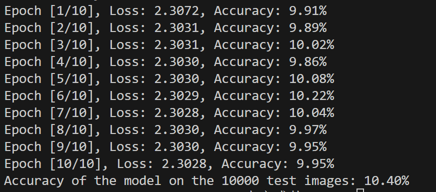

图像分类做题思路
====
2023091204024 刘伊贝
-----

## 一、“做题策略”问题思考
1. 计算机采用什么数据结构存储、处理图像？
彩色图像：`3\*h\*w`的多维数组
>3:RGB(通道维)
>h:高
>w：宽
2. 如何设计一个神经网络？一个神经网络通常包括哪些部分？
- 神经网络即多层感知机。
- 输入层——`激活函数1`——>隐藏层1——`激活函数2`——>隐藏层2——`回归函数`——>输出层
3. 什么是欠拟合？什么是过拟合？
- 欠拟合：模型无法得到较低的误差（过泛，不够准确）
- 过拟合：训练误差远小于测试误差（范围太窄，以偏概全）

## 二、题目思考
### 1.神经网络搭建
计划构造**单隐藏层**的神经网络：（LeNet）
- 卷积层块：卷积层——>最大池化层
    - 第一层输出通道：6
    - 第二层输出通道：16
    - 卷积层使用`5*5`的窗口
- 全连接层块：三个全连接层
    - 输出个数：120、84、10（10类物体）
- 激活函数：sigmoid函数

### 2. 模型训练以及评估
- 误差：交叉熵损失函数
- 优化：sgd

### 3. 调参过程
**初始参数**：
- batch_size = 128
- learning_rate =0.01
- 结果：

1. batch_size = 64，learning_rate =3
>调大lr，调小batch
Epoch [1/10], Loss: 2.3211, Accuracy: 10.11%
Epoch [2/10], Loss: 2.2426, Accuracy: 13.84%
Epoch [3/10], Loss: 1.9727, Accuracy: 26.45%
Epoch [4/10], Loss: 1.7437, Accuracy: 35.86%
Epoch [5/10], Loss: 1.5924, Accuracy: 41.81%
Epoch [6/10], Loss: 1.4997, Accuracy: 45.52%
Epoch [7/10], Loss: 1.4249, Accuracy: 48.42%
Epoch [8/10], Loss: 1.3562, Accuracy: 50.87%
Epoch [9/10], Loss: 1.3027, Accuracy: 52.98%
Epoch [10/10], Loss: 1.2398, Accuracy: 54.98%
Accuracy of the model on the 10000 test images: 45.03%

>目前还没有调整到比此更准确的参数

### 所遇问题：
1. **问题**：没有注意卷积之后图片输出shape会改变。
**解决方案**：应该为`in-kernnel_size+1`
2. **问题**：交叉熵损失的输入应该为tensor值，但显示输入值为None。
**解决方案**：发现损失函数的输入为`model（）`的输出，发现在`def`里面没有`return`,故添加`return x`，解决问题。

